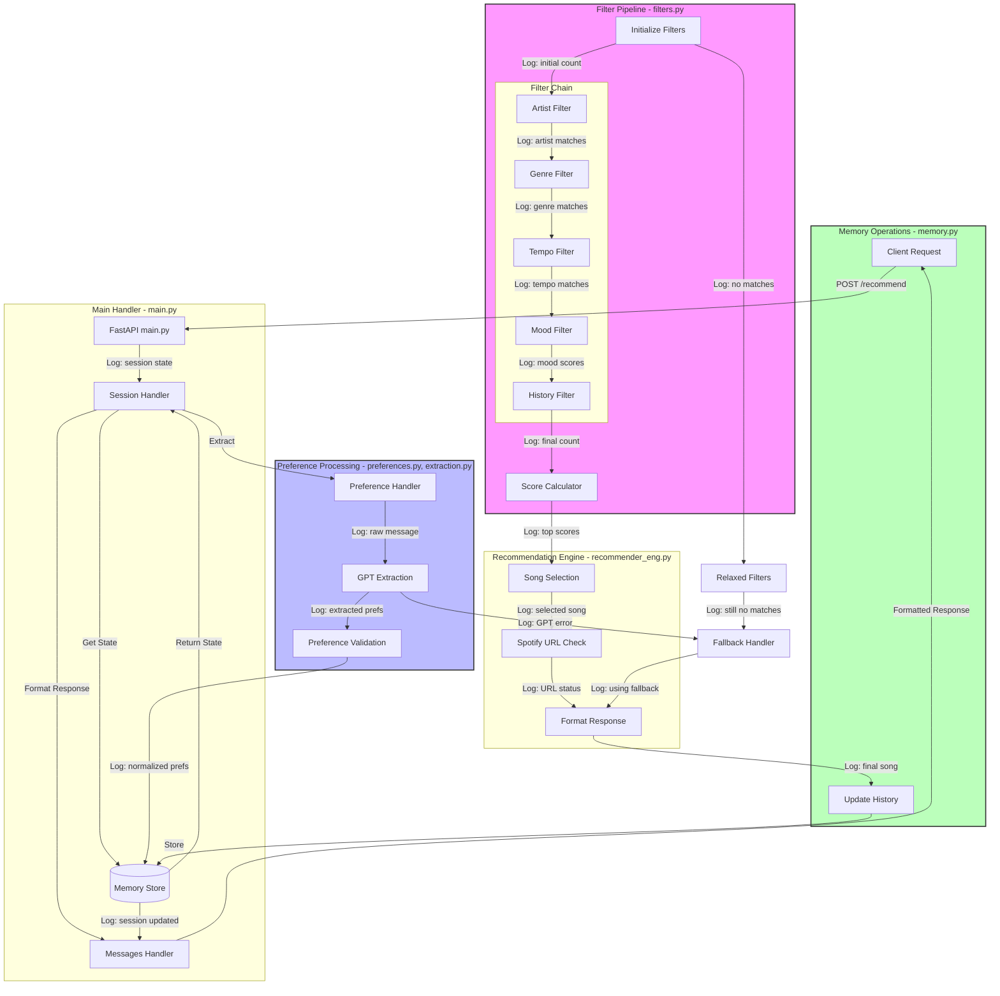

# Moodify Backend Workflow

## Message Processing Flow



## Component Responsibilities

### messages.py (Messages Handler)
- Centralizes all user-facing message content
- Organizes messages into logical categories:
  - Greeting messages
  - Recommendation responses
  - Feedback handling
  - Preference change prompts
  - Reset/restart messages
  - Error messages
- Provides utility methods for consistent formatting:
  - Green text wrapping
  - Emoji addition
  - Message templating
- Improves maintainability and consistency of user communication

### main.py (Main Handler)
- Handles HTTP endpoints and session state
- Routes messages to appropriate handlers
- Manages request/response lifecycle
- Coordinates between components
- Implements global error handling
- Handles user commands and feedback
- Uses Messages class for user communication

### preferences.py & extraction.py (Preference Processing)
- **preferences.py**:
  - Manages preference validation and normalization
  - Updates session with new preferences
  - Tracks preference completion state
  - Handles "no preference" cases with session state tracking
- **extraction.py**:
  - Communicates with GPT API
  - Extracts structured preferences from raw text
  - Handles preference validation rules
  - Uses fuzzy matching for "no preference" detection
  - Manages GPT error recovery

### recommender_eng.py (Recommendation Engine)
- Orchestrates the recommendation process
- Coordinates between filters and scoring
- Manages mood vector generation
- Handles fallback recommendations
- Formats final song responses
- Manages Spotify URL validation

### filters.py (Filter Pipeline)
- Implements the filter chain:
  - Artist/song matching with fuzzy search
  - Genre filtering with exact matches
  - Tempo filtering with BPM ranges
  - Mood-based filtering with similarity
  - History exclusion
- Manages filter relaxation
- Provides filter statistics and logging

### scoring.py (Score Calculator)
- Calculates weighted song scores based on:
  - Genre match weight
  - Mood similarity score
  - Tempo category match
  - Artist/song relevance
  - Popularity factor
- Provides score breakdowns for logging

### memory.py (Memory Operations)
- Manages thread-safe session storage
- Handles session state operations:
  - Preference updates
  - History tracking
  - Session resets
  - State persistence
- Prevents song repetition
- Manages concurrent access

## Data Flow Process

1. **Request Reception** (main.py)
   - User message received at `/recommend`
   - Session state loaded
   - User input extraction and validation
   - Initial greeting check (for new sessions)
   - Preference processing routing
   - Message formatting through Messages class

2. **Preference Processing** (preferences.py, extraction.py)
   - Raw message sent to GPT
   - Structured preferences extracted
   - Preferences normalized and validated
   - Session state updated

3. **Filter Application** (filters.py)
   - Artist/song filtering
   - Genre and tempo filtering
   - Mood-based similarity
   - History exclusion
   - Filter relaxation if needed

4. **Song Selection** (recommender_eng.py, scoring.py)
   - Score calculation
   - Song ranking
   - Selection validation
   - Spotify URL verification
   - Response formatting with Messages class

5. **State Update** (memory.py)
   - History tracking
   - Preference persistence
   - Session management
   - Message formatting and delivery

## Key Features

### Messages Structure
```python
class Messages:
    class Greeting:
        WELCOME = str  # Initial greeting message
    
    class Recommendations:
        NO_SONG_FOUND = str  # No song found message
        FEEDBACK_BUTTONS = str  # Feedback request
        POSITIVE_FEEDBACK = str  # Positive feedback response
    
    class Preferences:
        CHANGE_OPTIONS = str  # Preference change options
        CHANGE_FIELD = str  # Field change template
        INVALID_LAST_SONG = str  # Invalid song message
        AVAILABLE_COMMANDS = str  # Available commands list
    
    class Reset:
        CONFIRM = str  # Reset confirmation
        START_FRESH = str  # Start fresh message
    
    class Error:
        GENERIC = str  # Generic error message
```

### Session State
```python
{
    "genre": str | None,
    "mood": str | None,
    "tempo": str | None,
    "artist_or_song": str | None,
    "no_pref_genre": bool,             # Tracks explicit "no preference" states
    "no_pref_mood": bool,
    "no_pref_tempo": bool,
    "no_pref_artist_or_song": bool,
    "awaiting_feedback": bool,
    "history": List[Tuple[str, str]],
    "greeted": bool                     # Tracks if initial greeting was shown
}
```

### Command Types
- Change preferences
- Reset session
- Request new song
- Provide feedback

### Error Handling
- Global exception handling
- GPT fallback strategies
- Filter relaxation
- Input validation
- Session recovery
- Centralized error messages

### Performance Features
- Precomputed recommendation maps
- Efficient filter chain
- Thread-safe operations
- History deduplication
- Structured logging throughout pipeline
- Consistent message formatting
