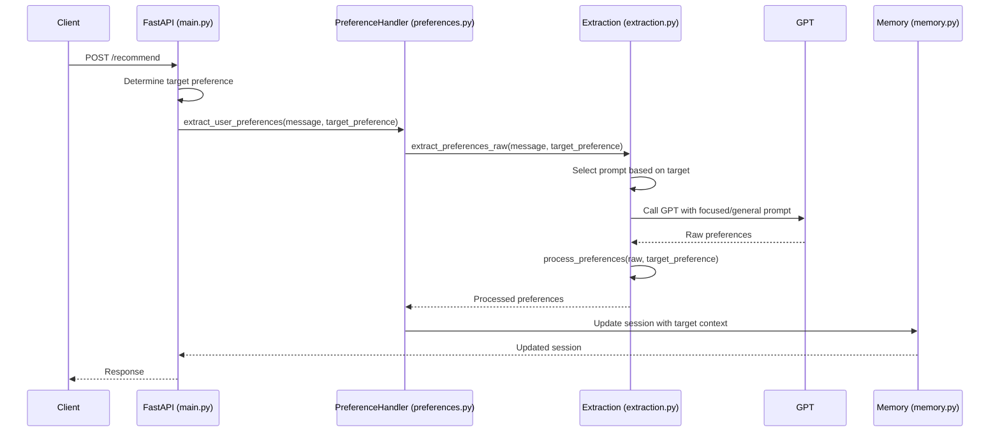

# Moodify Backend Workflow

## Message Processing Flow



## Component Responsibilities

### main.py
- Handles HTTP endpoints
- Manages session state
- Routes user messages to appropriate handlers
- Coordinates the recommendation flow
- Tracks and manages target preference context
- Handles preference change commands

### preferences.py
- Manages preference extraction workflow
- Updates session with new preferences
- Tracks preference state (set/not set)
- Determines when all preferences are collected
- Handles targeted preference updates

### extraction.py
- Handles raw GPT API communication for preference extraction
- Supports both focused and general preference extraction
- Processes and validates extracted preferences
- Manages preference normalization and validation
- Handles special cases (no preference, not music, etc.)

### utils.py
- Provides utility functions for chatting and recommendations
- Handles chat response generation
- Manages mood vectors and tempo conversions
- Provides fuzzy matching utilities

### prompts.py
- Centralizes all GPT prompts
- Maintains both focused and general extraction prompts
- Defines system roles for different GPT contexts
- Configures GPT settings for each prompt type
- Maintains prompt templates

### constants.py
- Defines all constant values
- Maintains lists of valid moods and genres
- Stores mood vectors and API settings
- Defines UI elements and feedback types

### memory.py
- Manages session storage
- Handles preference persistence
- Tracks conversation state
- Maintains target preference context

## Preference Processing Flow

1. **Input Reception**
   - User sends message to `/recommend` endpoint
   - System determines target preference based on context
   - Message can be explicit preference or conversation

2. **Target Preference Resolution**
   ```python
   # main.py
   target_preference = determine_target_preference(session, preference)
   extract_user_preferences(message, OPENAI_API_KEY, target_preference)
   ```

3. **GPT Processing**
   - System selects appropriate prompt based on target preference
   - Raw message sent to GPT with context about target preference
   - GPT returns structured preference data focused on target
   - Response is processed and validated
   - Special cases are handled (no preference, not music)

4. **Session Update**
   - New preferences are merged with existing session
   - Target preference context is maintained
   - Missing preferences are tracked
   - "No preference" states are recorded

5. **Recommendation Flow**
   - Once all preferences are set, recommendation engine is triggered
   - Recommendations are filtered based on preferences
   - Response is formatted and sent back to user

## Key Concepts

### Preference Fields
- genre
- mood
- tempo
- artist_or_song

### Session States
- Awaiting feedback
- Has all preferences
- Missing preferences
- No preference markers
- Current target preference

### Extraction Modes
- Focused extraction (when target preference is known)
- General extraction (when processing open-ended input)

### Preference Update Logic
- Target preference overrides existing values
- Non-target preferences only set if explicitly mentioned
- No-preference handling per target

### Error Handling
- Invalid preferences
- GPT API failures
- Missing session data
- Malformed responses

### Prompt Management
- System roles for different contexts
- Focused extraction prompts
- General extraction prompts
- GPT parameter configurations
- Fallback responses

### Data Validation
- Mood validation against known set
- Genre validation against known set
- Tempo category normalization
- Fuzzy matching for inexact inputs
